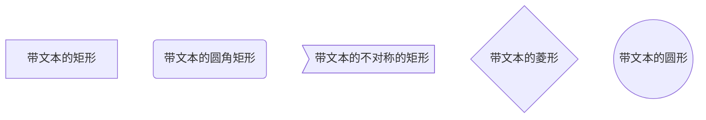
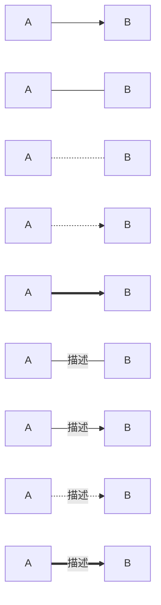
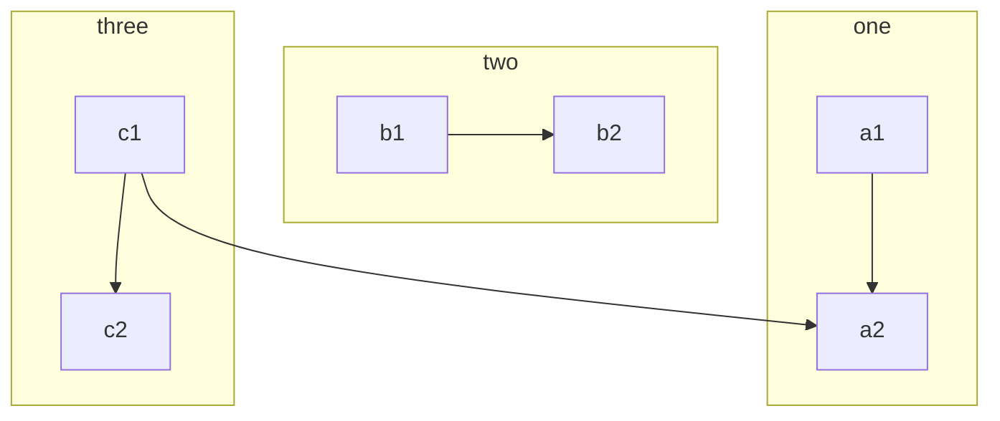
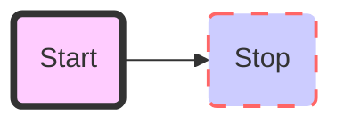
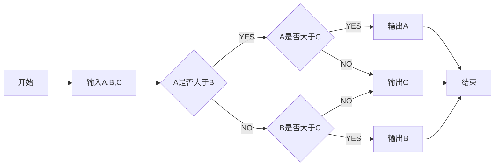

---
​---测试一下--
---
# MarkDown语法
[TOC]


## 一. 文字

### 1. 字体样式

|                        语法                         |     效果     |
| :-------------------------------------------------: | :----------: |
|                  `*斜体*` `_斜体_`                  |     斜体     |
|                `**粗体**` `__粗体__`                |     粗体     |
|            `***斜粗体***` `___斜粗体___`            |    斜粗体    |
|                    `~~删除线~~`                     |    删除线    |
| `***~~斜粗体删除线1~~***` `~~***斜粗体删除线2***~~` | 斜粗体删除线 |
|                    ==底色文字==                     |   底色文字   |


### 2. 注释

<!--注释--> 


### 3. 锚点

注脚[^1]

[^1]: 注脚

H~O~2


### 4. 引用文本

>这是引用的内容
>
>>这是引用的内容


### 5. 分割线

---
----
***
*****


## 二. 图片与超链接

### 1. 图片

使用  插入图像。

图片alt就是显示在图片下面的文字，相当于对图片内容的解释。
图片title是图片的标题，当鼠标移到图片上时显示的内容。title可加可不加


### 2.超链接

1. [显示内容](连接 "悬停现实内容")

2. [显示内容][文本]

示例

1. [简书](http://jianshu.com)
2. [百度](http://baidu.com)
3. [我的博客](http://blog.csdn.net/guodongxiaren "悬停显示")


## 三.列表与任务列表

### 1.列表

#### 1.1无序列表

- 列表内容
+ 列表内容
* 列表内容
注意：- + * 跟内容之间都要有一个空格


#### 1.2有序列表

1. 列表内容
2. 列表内容
3. 列表内容

注意：序号跟内容之间要有空格


#### 1.3列表嵌套

1. 一级
	1. 二级
	2. 二级
2. 一级


### 2. 任务列表

- [ ] 任务一
- [x] 任务二
- [ ] 任务三


## 四. 表格

| 表头 | 表头 | 表头 |
| :--: | :--: | :--: |
| 内容 | 内容 | 内容 |
| 内容 | 内容 | 内容 |

第二行分割表头和内容。
- 有一个就行，为了对齐，多加了几个
文字默认居左
两边加：表示文字居中
右边加：表示文字居右
注：原生的语法两边都要用 | 包起来。此处省略


## 五. 代码

### 1. 行内代码

`测试`


### 2. 三个`标识代码

```javascript
//js代码
```


### 3. 四个空格也可以代表代码段

```python
测试
```


## 六. 公式

### 1. 行内公式

$E=mc^2$

### 2. 块公式


$$
\sum_{i=1}^n a_i=0
$$

## 七. 图

### 1. mermaid流程图语法

#### 1.1. 流程图方向有下面几个值

- TD 从上到下
- BT 从下到上
- RL 从右到左
- LR 从左到右
- TD 同TB
- 

#### 1.2. 基本图形




#### 1.3. 节点之间的连接




#### 1.4. 子流程




#### 1.5.样式



#### 1.6 示例



```seq
Alice->Bob: Hello Bob, how are you?
Note right of Bob: Bob thinks
Bob-->Alice: I am good thanks!
```

```gas
    title 项目开发流程
    section 项目确定
        需求分析       :a1, 2016-06-22, 3d
        可行性报告     :after a1, 5d
        概念验证       : 5d
    section 项目实施
        概要设计      :2016-07-05  , 5d
        详细设计      :2016-07-08, 10d
        编码          :2016-07-15, 10d
        测试          :2016-07-22, 5d
    section 发布验收
        发布: 2d
        验收: 3d
```

```flow
st=>start: 开始
op=>operation: My Operation
cond=>condition: Yes or No?
e=>end
st->op->cond
cond(yes)->e
cond(no)->op
&```

```

## 八. 表情

:grin::smile::heartpulse:✔️ ❓ 😂 :ok_hand::wave::+1: